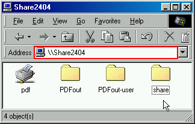
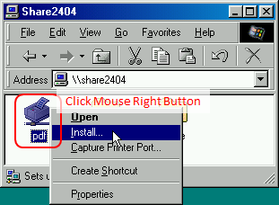
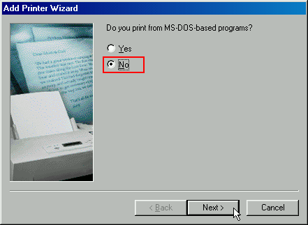
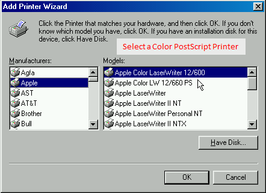
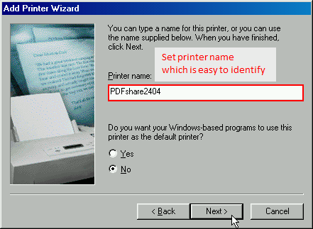
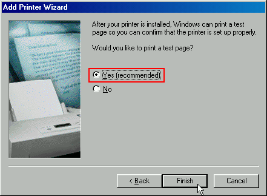
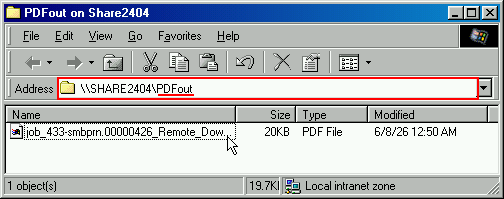

# Build Samba and Share Folder and Printer with Windows 98

## Introduction

Build Samba server and connect Windows 98 clients to
the server. The server provides two services,

+ Share folder
  + Anyone can access
+ Virtual PDF printer
  + Use CUPS-PDF package printer-driver-cups-pdf
  + Only prints to A4 size paper
  + Share output PDF files
    + Anyone can access

This git repository contains following items,

+ [samba-3.6.25 source code](samba-3.6.25/)
  + Will be patched
  + If you want to obtain your own Samba source code
    and want to patch it manually,
    [you can get patches from this repository](#get-patches-to-samba).
+ [Patches to apply samba-3.6.25](#get-patches-to-samba)
  + Fix error and incorrect detection result at configure.
    + Includes fix compile error at make step.
  + Fix "User intervention required" error when printing
    from Windows 98 clients.
+ [Build Scripts](./build-steps/)
  + [Install required package](./build-steps/00-install-packages.sh)
  + [Configure wrapper](./build-steps/10-configure.sh)
  + [Make wrapper](./build-steps/20-make.sh)
+ [Sample configuration files](./examples/cups-pdf-share/)
  + [Samba configuration](./examples/cups-pdf-share/root/etc/samba3/smb.conf)
  + [CUPS-PDF configurations](./examples/cups-pdf-share/root/etc/cups/cups-pdf.conf)
  + [Directories layout example](./examples/cups-pdf-share/root/)
    + Share folder
    + Virtual PDF printer
      + Spool Directory
      + Directory to store output PDF files
  + [Windows 98 virtual PDF printer driver](./examples/cups-pdf-share/win98/driver/a4/)
    + [Driver INF file](./examples/cups-pdf-share/win98/driver/a4/GSPDFA4.INF)
    + [SPD file based on Simplified PPD file](./examples/cups-pdf-share/win98/driver/a4/GSPDFA4.SPD)

Supported OSes are,

+ Ubuntu 22.04, 24.04, and 26.04
  + May support delivered flavors.
  + Supports coreutils from gnu and rust rewritten uutils.
+ Raspberry Pi OS Trixie (Debian 13) release
  + Supports 32bit and 64bit targets.

## Download

If you haven't installed git, install git to clone this repository.

```bash
sudo apt update
sudo apt install git
```

Clone this repository. Here _$GitBase_ is the base directory to
clone `samba-win98-lpt-share`.

```bash
cd $GitBase
git clone https://github.com/Akinori-Furuta/samba-win98-lpt-share.git
```

The `main` branch contains patched samba-3.6.25.

## Install Required Packages

Install tools and libraries to build and run samba-3.6.25, and CUPS-PDF.

### Packages to Build Samba

Install required packages. You may be requested your password
to acquire root privilege.

```bash
# continue from previous command type in
cd samba-win98-lpt-share
./build-steps/00-install-packages.sh
```

> [!TIP]
> Some of packages may become redundant.

### CUPS-PDF Printer Package

You want to service virtual PDF printer, you need to install
CUPS-PDF printer package.

```bash
# continue from previous command type in
sudo apt install printer-driver-cups-pdf
```

## Configure and Build

Configure samba-3.6.25 with prefix `/usr/local/samba`. Build it.

```bash
# continue from previous command type in
./build-steps/10-configure.sh
```

You may see error messages like the following text  during the configuration process (removed underlines and error position markers). These errors are known issues. Continue configure and make.

```text
checking for python... /usr/bin/python
checking for python2.6-config... no
checking for python2.5-config... no
checking for python2.4-config... no
checking for python-config... /usr/bin/python-config
  File "<string>", line 1
    from distutils import sysconfig;       print '-I%s -I%s %s' % ( sysconfig.get_python_inc(), sysconfig.get_python_inc(plat_specific=1), sysconfig.get_config_var('CFLAGS'))
SyntaxError: Missing parentheses in call to 'print'. Did you mean print(...)?
  File "<string>", line 1
    from distutils import sysconfig;        print '%s %s -lpython%s -L%s %s -L%s' % ( sysconfig.get_config_var('LIBS'), sysconfig.get_config_var('SYSLIBS'), sysconfig.get_config_var('VERSION'), sysconfig.get_config_var('LIBDIR'), sysconfig.get_config_var('LDFLAGS'), sysconfig.get_config_var('LIBPL'))
SyntaxError: Missing parentheses in call to 'print'. Did you mean print(...)?
Traceback (most recent call last):
  File "<string>", line 1, in <module>
    import sys; sys.exit(sys.version_info.__getslice__(0, 2) >= (2, 4))
AttributeError: 'sys.version_info' object has no attribute '__getslice__'. Did you mean: '__getstate__'?
checking working python module support... no
```

Build samba-3.6.25.

```bash
# continue from previous command type in
./build-steps/20-make.sh
```

## Install

Install samba-3.6.25 into `/usr/local/samba`. They don't overwrite the
Samba installed by `samba` package. They keep side by side installation.

```bash
# continue from previous command type in
sudo ./build-steps/20-make.sh install
```

### Setup Files and Directories

Read every READMEs under [examples/cups-pdf-share/root](./examples/cups-pdf-share/root/),
and setup your Samba server. You need setup
following items according to READMEs or your
favorite configurations.

+ [Setup init scripts](./examples/cups-pdf-share/root/etc/init.d/README)
  + The following steps assume that you install init scripts
    [nmbd3](./examples/cups-pdf-share/root/etc/init.d/nmbd3) and
    [smbd3](./examples/cups-pdf-share/root/etc/init.d/smbd3)
    into /etc/init.d.
+ [Setup Samba configuration](./examples/cups-pdf-share/root/etc/samba3/README)
  + [Place smb.conf at /usr/local/samba/lib/smb.conf](./examples/cups-pdf-share/root/usr/local/samba/lib/README)
  + [Create symbolic links from /etc/samba3](./examples/cups-pdf-share/root/etc/samba3/README)
+ [Setup share folder](./examples/cups-pdf-share/root/home/)
  + [/home/nobody](./examples/cups-pdf-share/root/home/nobody)
    + /home/nobody/share
+ [Setup CUPS-PDF (virtual PDF printer)](./examples/cups-pdf-share/root/etc/cups)
  + [/etc/cups/cups-pdf.conf](./examples/cups-pdf-share/root/etc/cups/cups-pdf.conf)
    + [/etc/cups/ppd/PDF.ppd](./examples/cups-pdf-share/root/etc/cups/ppd)
+ [Setup printing spool (temporal directory)](./examples/cups-pdf-share/root/var/spool/cups-pdf)
  + /var/spool/cups-pdf/SPOOL
+ [Setup PDF output directory](./examples/root/var/spool/cups-pdf/)
  + /var/spool/cups-pdf/ANONYMOUS

## Load init Scripts into systemd

Load [nmbd3](./examples/cups-pdf-share/root/etc/init.d/nmbd3)
and [smbd3](./examples/cups-pdf-share/root/etc/init.d/smbd3)
init scripts into systemd.

```bash
sudo systemctl daemon-reload
```

### Check samba-3.6.25's smb.conf

Run testparm3 to check samba built with prefix /usr/local/samba.
If you didn't [create a symbolic link testparm3](./examples/cups-pdf-share/root/usr/local/bin/README) in /usr/local/bin,
you can run testparm using full path /usr/local/samba/bin/testparm
to executable.

```bash
testparm3 # or /usr/local/samba/bin/testparm
```

### Replace Samba Server

If you already installed Samba server package, stop the Samba server.

```bash
# Stop Samba server install by package
sudo systemctl stop nmbd smbd
```

Start samba-3.6.25 server.

```bash
# Start Samba server built from samba-3.6.25
sudo systemctl start nmbd3 smbd3
```

## Setup Windows 98 Client(s)

You can see the Samba server from a Windows 98 client.
Type server name as `\\server-name` and **\[Enter\]** in
a explorer's address bar. The following picture shows
explore server `\\share2404`.



### Share Folder

Open `\\server-name\share` in a explore. You can see a share folder.
All files and directories in `share` are public to the connected
network (for most cases inside router). Every one can see and read them.

### Virtual PDF Printer

Open `\\server-name` in a explore, and **[right-button click]** on
the PDF printer, You can see **Install...** in popup-menu. **[Click]** **Install...** and start printer setup wizard.



It may be better to select **No** as "print from MS-DOS based program".



Select a Color PostScript Printer.



Here are some printer models suitable for the virtual PDF
printer. The virtual PDF printer can print to only A4
size paper.

|Manufacturer|Printer|Note|
|------------|-------|----|
|Apple|Apple Color LaserWriter 12/600 PS|*1|
|QMS|QMS ColorScript 210|*1|
|HP|HP LaserJet PS|*1|
|Ghost Script|GhostScript PDF A4|[Driver files](examples/cups-pdf-share/win98/driver/a4/)|

+ *1: Select paper size A4

Set the printer name which is easy to identify.



Finish Add Printer Wizard. It's better to print "Test Page".



After installed the virtual PDF printer, you can see it in
**Task bar Start** - **Settings** - **Printers**.

All files printed from virtual PDF printer are stored
into `server-name\PDFout`. They are public to connected
network. Every one can see and read them.



> [!TIP]
> If you add user whose name is same to Windows logon
> user to the Samba server, you will get PDF output file
> in /var/spool/cups-pdf/_User_ directory. You need
> to setup the directory.

## Get Patches to Samba

If you want patches to samba source code. You can get patches from git
differences tag to tag. Patches are divided into two branches.

+ Make configure result more better.
  + Includes fix compile error at make step.
+ Fix Windows clients fail printing with "user intervention required".

Change directory on git cloned repository.

### Make Configure Result More Better and fix build error

./configure may fail or result incomplete detection of libraries and
tool-chain capabilities. And also, you may see compile error at make.
Commits from base-mods to fixed-build-issue contains fix ./configure
and build issues. You can dump differences as follows.

```bash
cd /your/cloned/repository/samba-win98-lpt-share
git diff base-mods fixed-build-issue | tee fixed-build-issue.diff
```

### Fix Windows Clients Fail Printing with "user intervention required"

Windows clients fail printing or can't finish printing with
"user intervention required". samba-3.6.25 has bug which
causes this issue.
Commits from base-mods to fixed-samba-lp-issue contains fixes
which resolve "user intervention required" issue.
You can dump differences as follows.

```bash
cd /your/cloned/repository/samba-win98-lpt-share
git diff base-mods fixed-samba-lp-issue | tee fixed-samba-lp-issue.diff
```

### Apply Patches

The following example shows applying patches fixed-build-issue.diff
and fixed-samba-lp-issue.diff to Samba source code expanded from tar ball.

```bash
tar xvf samba-3.6.25.tar.gz
cd samba-3.6.25
patch -p2 < /your/cloned/repository/samba-win98-lpt-share/fixed-build-issue.diff
patch -p2 < /your/cloned/repository/samba-win98-lpt-share/fixed-samba-lp-issue.diff
```

### Build Patched samba-3.6.25

After apply patches to Samba source code, you can configure and make as follows,

```bash
# continue from previous command typing...
cd source3
build_tuples="$( make -v | grep -i 'Built' | awk '{print $NF}' )"
./configure --enable-cups --enable-iprint \
--disable-external-libtalloc --disable-external-libtevent \
--disable-external-libtdb \
"--build=${build_tuples}"
make
```

## Appendix: Tags and Branches in This Repository

The following table shows tags in this repository.

|Tag|On branch(es)|Description|
|---|---------|-----------|
|base-mods|main, work|Add original samba-3.6.25 source code tar ball.|
|fixed-build-issue|patch-to-build|Commits to fix `configure` issues, and to fix compile error at make step.|
|fixed-samba-lp-issue|patch-samba-printing-issue|Commits to fix "User intervention required" after printing issue.|

The following table shows branches in this repository.

|Branch|Description|
|------|-----------|
|main|All patches, scripts, and documents are merged|
|work|Stay at `base-mods` tag, you can catchup main branch by merging patch-to-build, patch-samba-printing-issue, build-steps, and add-extras to work branch|
|patch-to-build|Branched from base-mods, and contains commits to fix `configure` fails detecting libraries and tool-chain capabilities, also to fix compile error at make step.|
|patch-samba-printing-issue|Branched from base-mods, and contains commits to fix "User intervention required" after printing issue.|
|build-steps|Branched from base-mods, and contains commits to wraps build commands|
|add-extras|Commits contain Documents, Examples, and Helper scripts|

### Create a Your Own Branch

To create a your own working branch, start branch from `work` (`base-mods`),
and merge `patch-to-build`, `patch-samba-printing-issue`, `build-steps`,
and `add-extras`. Following example shows create a working branch `work-local`
and merge branches, `work-local` becomes same as `main`.

```bash
git branch work-local origin/work # or git branch work-local base-mods
git checkout work-local
git merge origin/patch-to-build origin/patch-samba-printing-issue \
origin/build-steps origin/add-extras
```

## Appendix: Text Encoding in PDF Files

Windows clients produce PostScript files containing custom encoded
(mangled) texts. Texts are optimized for embedded fonts. So, they
are readable in visual. But you can't copy and search them exactly
from tools.

To make texts more readable from tools, change
settings as follows.

+ Open Printer Property on Windows 98 client
  + **[Start]** -> **[Settings]** -> **[Printers]**
    -> **[Right Click Printer Icon]** -> **[Properties]**
+ Open **[Fonts]** Tab
+ Select "Always built in fonts, instead of True Type fonts"
  or "Always use TrueType fonts"
+ Click **[OK]** or **[Apply]**

Be careful, above settings may shift position of
objects on printed output, and also change
font glyph. For most cases, prints become ugly.
